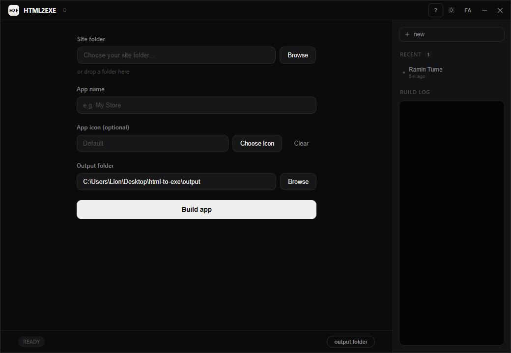

# HTML2EXE

Turn any HTML/CSS/JS site into a standalone Windows `.exe` — no coding, no backend, no install step for the people you hand it to.



## What it does

- Takes any HTML/CSS/JS folder (a single page or a full site) and packages it into a portable Windows desktop app.
- The generated app runs fully offline — nothing else to install on the end user's machine.
- Built-in local database (SQLite via [sql.js](https://sql.js.org/)), exposed to the page as `window.db.query(sql, params)` / `window.db.run(sql, params)` — sites can persist data with no separate backend server.
- Output is a single portable `.exe` file — copy it anywhere and run it.
- Bilingual (English / Farsi, RTL-aware) desktop GUI for picking the site folder, app name, icon, and output location, with a live build log and a history of recent builds.

## Usage

### Running from source

```
npm install
npm run dev
```

Pick a site folder, give the app a name (and optionally an `.ico` icon), and press **Build app**. The finished `.exe` lands in the output folder shown in the app (defaults to `./output`).

### CLI

The GUI is a front end for `build.js`, which can also be run directly:

```
node build.js --input <siteFolder> [--name "App Name"] [--icon icon.ico] [--output ./output]
```

## How a generated app works

Every generated app is an Electron app built from `template/`: it loads the site's `index.html` (or the first `.html` file it finds), and if the page calls `window.db.query`/`window.db.run`, those calls are backed by a local SQLite file stored in the app's own user-data folder — no server, no network required.

## Project layout

- `main.js`, `preload.js`, `renderer/` — the HTML2EXE desktop GUI itself.
- `build.js` — the CLI that does the actual packaging (spawned by the GUI, or run standalone).
- `template/` — the Electron app template every generated app is built from.
- `sample-site/` — an example input site to try the tool with.

## Requirements

- Windows
- Node.js

---

Created By Ramin Turne · Telegram: [Fast_Amozesh](https://t.me/Fast_Amozesh)
